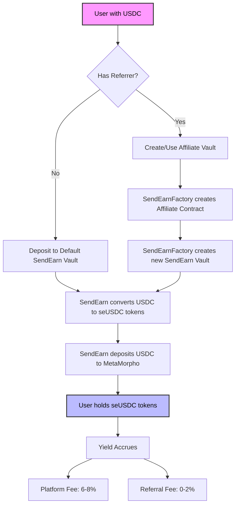

# Send Earn Protocol

## Overview
Send Earn is a permissionless, non-custodial yield-generating protocol built on MetaMorpho. Users deposit USDC to earn automated yield while enabling a novel referral system that rewards community growth.

## How it works

Each user deposits into the Send Earn vault. Optionally, a user can set a referrer. This allows referrals to be set for each user and effectively shares the fees between the platform (send.app) and the referrer.

The vault tracks the user's share of the vault's assets and the vault's assets in the mwUSDC vault. When a user deposits into the Send Earn vault, the vault deposits into the mwUSDC vault on behalf of the user. The vault then mints shares to the user.

When a user withdraws from the Send Earn vault, the vault redeems the user's underlying mwUSDC shares from the Morpho vault, updates the Send Earn fees, and sends the user's underlying mwUSDC shares to the user.

The user's deposits are supplied as liquidity to lending pools. A user earns yield from the Morpho protocol on their USDC deposits which accrue and compound automatically.

Fees are paid by the interest accrued on the user's deposit in the Send Earn vault. Optionally, when a user deposits into the Send Earn vault, if a user was referred by another user, a portion of the fee should be paid to the referrer. The fees and interest are updated every time the vault's assets are updated.




## Protocol Components

### Core Architecture
- **Vault Layer**: ERC4626-compliant vault managing user deposits and shares
- **Yield Layer**: Integration with MetaMorpho for yield generation
- **Asset Flow**: USDC → seUSDC → MetaMorpho → Yield
- **Token Standard**: ERC20 with ERC4626 vault extensions

### Key Features
1. **Permissionless Deposits**
  - Direct USDC deposits
  - Automated yield generation
  - No minimum deposit requirements
  - Instant withdrawals (subject to liquidity)

2. **Referral System**
  - Immutable referral relationships
  - Referrer rewards from yield fees
  - Automated fee distribution
  - No impact on user deposits

3. **Fee Structure**
  - Base platform fee: 6-8% of yield
  - Optional referral fee: 0-2% of yield
  - Fees only apply to generated yield
  - No deposit or withdrawal fees

## Technical Implementation

### Core Contracts
1. **SendEarn Vault**
  - Manages user deposits and withdrawals
  - Handles share token (seUSDC) minting/burning
  - Tracks asset positions and yield
  - Implements ERC4626 standard

2. **SendEarnFactory**
  - Creates new vault instances
  - Manages affiliate relationships
  - Maintains protocol registry
  - Controls fee configurations

3. **SendEarnAffiliate**
  - Handles referral relationships
  - Manages fee splitting
  - Tracks referral earnings
  - Automates reward distribution

### Security Features
1. **Administrative Controls**
  - Two-step ownership transfers
  - Configurable fee limits
  - Protected admin functions
  - Emergency pause capabilities

2. **Asset Safety**
  - Round-down conversions
  - Slippage protection
  - Balance validations
  - Liquidity checks

### Advanced Functions
1. **Yield Management**
  - Automated yield collection
  - Compound interest
  - Fee accrual tracking
  - Precise calculations

2. **Integration Features**
  - Multicall support
  - ERC20Permit integration
  - MetaMorpho rewards handling
  - Collections system

## Protocol Operations

### User Workflows
1. **Standard Deposit**
  ```
  USDC → Default SendEarn Vault → seUSDC tokens
  ```

2. **Referred Deposit**
  ```
  USDC → Affiliate Vault → seUSDC tokens
  ```

3. **Yield Generation**
  ```
  seUSDC → Yield Accrual → Fee Split (Platform/Referrer)
  ```

### Administrative Functions
1. **Fee Management**
  - Set platform fee rates
  - Configure referral splits
  - Update fee recipients
  - Manage collections

2. **Protocol Updates**
  - Vault parameters
  - Integration settings
  - Security controls
  - Emergency functions

## Technical Specifications

### Asset Properties
- Base Asset: USDC (6 decimals)
- Vault Token: seUSDC (18 decimals)
- Yield Source: MetaMorpho

### Precision Handling
- WAD precision (18 decimals)
- Decimal normalization
- Rounding rules
- Conversion safety

### Integration Points
- MetaMorpho interface
- ERC20 compliance
- ERC4626 vault standard
- External reward systems
