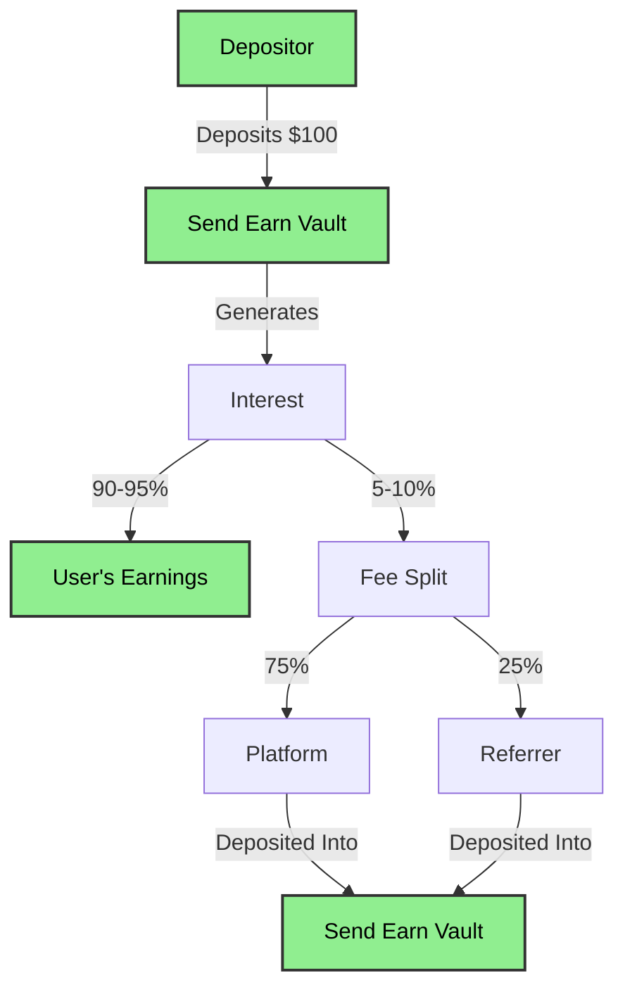
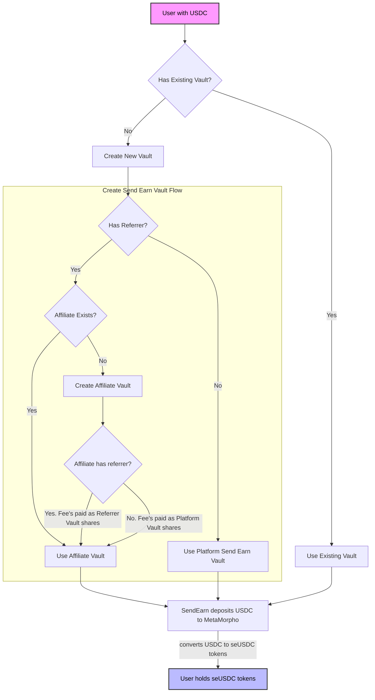
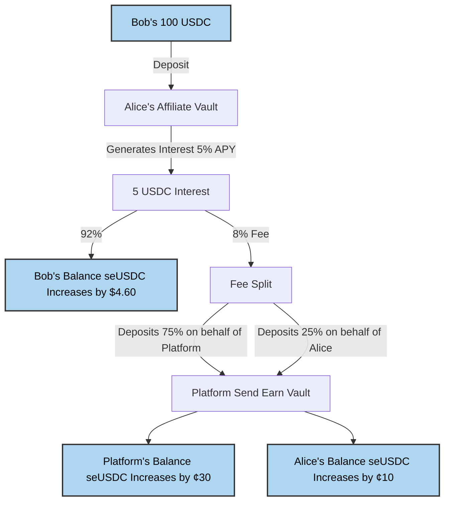
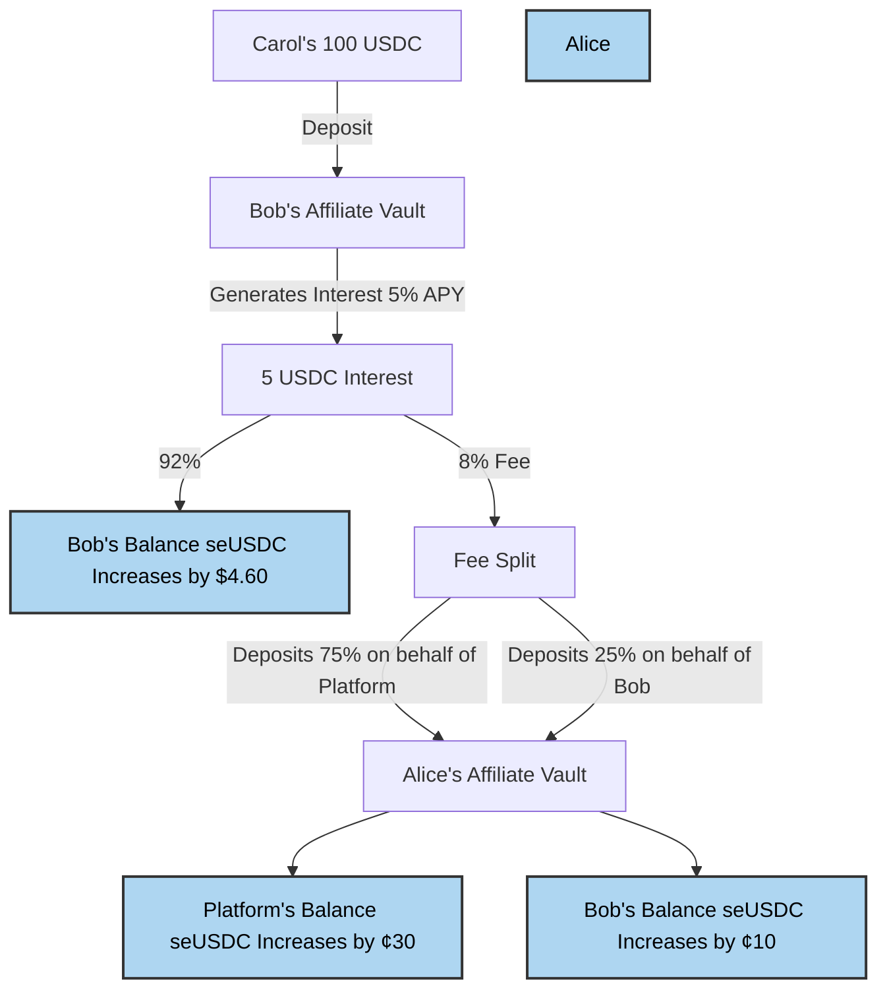

# Send Earn Affiliates

Send Earn's affiliate program allows users to earn a share of interest fees by referring others. **IMPORTANT: Fees are ONLY taken from generated interest - never from the initial deposit amount. Your principal is always safe.** When a user deposits into a Send Earn vault, the vault mints shares of the vault to the user.

> [!NOTE]
> Affiliate is synonymous with referrer in this documentation. Affiliates earn yield from their referrals deposits.

## Types of Vaults

The Send Earn platform has two kinds of vaults:

- Platform Vault: This is the default vault for all users when they don't have an affiliate.
- Affiliate Vault: This is a vault for users who have a referrals where interest fees are split between the referrer and the platform.

## Fee Structure

**Critical Points:**
- Initial deposits are NEVER affected by fees
- Fees are ONLY taken from a portion of earned interest
- Original deposit amount always remains 100% intact

Fee splits:
- Regular deposits: 100% of interest fees go to Send Earn Platform
- Affiliate referral deposits: Interest fees are split 75/25
  - 75% goes to Send Earn
  - 25% goes to the referrer

## How it Works

### Send Earn Deposits

The following diagram shows the basic flow of a user depositing into a Send Earn vault:

### Send Earn Vault Selection

Users deposit into a Send Earn vault and in turn, shares are minted to the user
as seUSDC tokens. Simply holding seUSDC tokens is enough to earn yield on the
underlying vault.

The follow diagram shows the selection of a Send Earn vault for a user when
the are depositing into a Send Earn vault:

### Basic Example
1. Alice refers Bob
2. Bob deposits 100 USDC into Alice's affiliate vault
3. Bob's deposit earns 5% APY interest
4. A small fee (8%) is taken ONLY from the earned interest
5. The fee is split: 75% to Send Earn, 25% to Alice as Platform Send Earn shares since Alice has **no referrer**
6. Alice can withdraw her earnings anytime

### Multi-Level Example with Earnings Distribution

When Bob (who was referred by Alice) refers someone else:

Bob refers Carol
1. Carol deposits 100 USDC into Bob's affiliate vault
2. Carol's deposit generates interest
3. Interest fees are split:
4. 75% to Send Earn
5. 25% to Bob
6. Bob's earnings are automatically deposited into Alice's affiliate vault
7. This creates a chain where the fees are automatically deposited into affiliate vaults: Carol → Bob → Alice

### Fee Splitting

The fees are collected first seUSDC shares of the vault and are minted to a fee recipient which is a Fee Splitter contract. The Fee Splitter contract is a smart contract that can be configured to split the fees between the platform and the referrer.

The vault fees are first withdrawn from the vault as the underlying asset (USDC) and then deposited into a Send Earn vault onbehalf of the parties involved in the fee split using the current platform split percentage.
